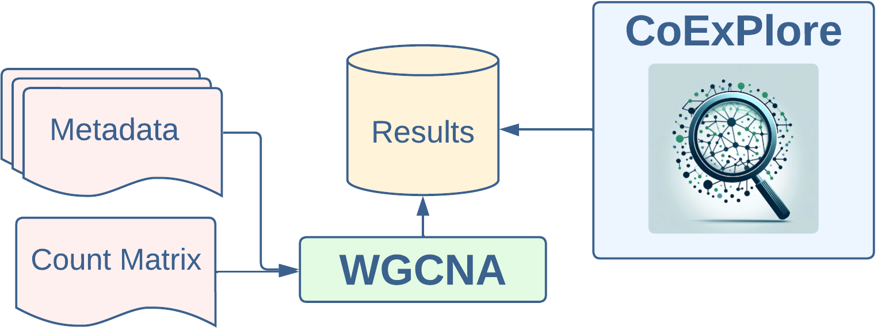

<h1 align="center">CoExPlore</h1>

<h2 align="center">
  
</h2>

**CoExPlore** is a modular framework designed for comparative co-expression network analysis across multiple datasets. It integrates automated data preprocessing, network construction, and interactive visualization in a single workflow. CoExPlore enables users to identify co-expression modules, analyze eigengenes, and explore module-trait relationships while integrating functional metadata like GO terms and orthogroups.

---

## Features

- **Comparative Co-Expression Analysis**: Supports cross-dataset comparisons of co-expression networks, eigengenes, and module-trait relationships.
- **Metadata Integration**: Enhances biological insights with GO terms, orthogroups and more.
- **Automated Workflow**: Transforms count matrices and metadata into `.h5ad` and TOM files using Snakemake.
- **Interactive Visualization**: Explores co-expression networks via a web-based interface.
- **Sub-module Analysis**: Identification and exploration of refined sub-modules, such as transcription factor networks or specific gene groups, enabling targeted investigation of gene regulatory mechanisms across species.

---

## Workflow

<h2 align="center">
  
</h2>

1. **Preprocessing with Pipeline**:
   - Use `docker-compose-pipeline.yaml` to convert count matrices and metadata into `.h5ad` and TOM files.

2. **Start the Web App**:
   - Use `docker-compose-app.yaml` to deploy the interactive web application.

3. **Interactive Exploration**:
   - Analyze generated files and compare co-expression networks interactively, integrating functional annotations and exploring module overlaps.

---

## Quick Start

### 1. Clone the Repository

```bash
git clone https://github.com/Mfkessler/CoExPlore.git
cd CoExPlore
```

### 2. Build the Docker Images

```bash
docker build -t coexplore-base -f Dockerfile.base .
docker build -t coexplore-pipeline -f Dockerfile.pipe .
docker build -t coexplore-app -f Dockerfile.app .
```

### 3. Run Preprocessing

1. **Edit `pipeline/config.yml`**:
   - Set paths for input data like count matrices and metadata.

2. **Execute Pipeline**:
   ```bash
   docker compose -f docker-compose-pipeline.yaml up
   ```
   - Generates `.h5ad` and TOM files in the `output` directory.

### 4. Start Web Application

```bash
docker compose -f docker-compose-app.yaml up
```

Access the application at [http://localhost:5001](http://localhost:5001) to analyze your data interactively.

---

## Key Components

- **Package**: Found in `package/`, provides core WGCNA functionality.
- **Pipeline**: Located in `pipeline/`, automates preprocessing with Snakemake.
- **App**: Located in `app/`, offers an interactive web interface for analysis.

---

## License

This project is licensed under the MIT License.

---

## Developer

**Micha Frederick Keßler**

- **Email**: micha.kessler@computational.bio.uni-giessen.de
- **Affiliation**: Bioinformatics and Systems Biology, Justus Liebig University, Gießen
